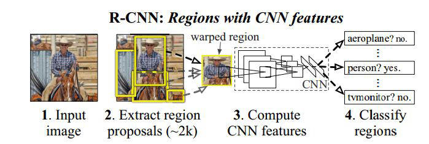

# DeepLearning_ObjectDetection
Object Detection目标检测与识别—复杂环境下的Logo识别

## 相关 Deep Learning Object Detection 推荐

- M2Det (2019)
- RefineDet (2018)
- **YOLOv3 (2018)**
- **Mask R-CNN (2018)**
- **RatinaNet (2017)**
- FPN (2017)
- YOLOv2 (2017)
- R-FCN (2016)
- SSD (2016)
- YOLOv1 (2016)
- **Faster R-CNN (2015)**
- Faste R-CNN (2015)
- R-CNN （2013）

---

# 复杂环境下的Logo识别

## 依赖
- Python
- Anaconda
- TensorFlow

### RCNN原理图

### 原始数据展示(部分)

### SelectiveSearch

### 结果及应用展示（概率、Softmax向量）

## License
[MIT](./LICENSE)